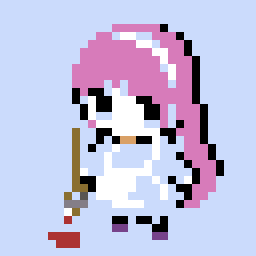

<!-- ============================================================
     KUBUTAKU.exe  --  RPG-style profile README
     ============================================================ -->

<div align="center">

<!-- ─── TITLE SCREEN ─────────────────────────────────────────── -->


<!-- ─── NPC DIALOGUE (typing SVG, Press Start 2P) ───────────── -->

<a href="https://github.com/apokurinkansen">
  
</a>

<br/>

<!-- ─── PLAYER SPRITE ───────────────────────────────────────── -->



<br/>

<sub><b>★ PLAYER ★</b></sub>

<!-- ─── BADGES ROW (profile vitals) ─────────────────────────── -->

<p>
  <a href="https://github.com/apokurinkansen?tab=followers"></a>
  <a href="https://github.com/apokurinkansen"></a>
  
</p>

</div>

<!-- ============================================================
     PLAYER STATUS
     ============================================================ -->

## 

<table>
<tr>
<td valign="middle" width="55%">


</td>
<td valign="middle" width="45%">

```yaml
title:    "散らかったデータを、使えるデータに"
home:     Google Cloud / BigQuery / dbt
weapon:   Python + SQL
mount:    PostgreSQL
quest:    "Ship a game I made myself"
mantra:   [small, explicit, tested, automated]
```

</td>
</tr>
</table>

<!-- ============================================================
     SKILL TREE
     ============================================================ -->

## 

<table>
<tr>
<td valign="middle" align="right" width="180">

🗡️ &nbsp;**MAIN CLASS**<br/><sub>Data Engineer</sub>

</td>
<td valign="middle">


</td>
</tr>
<tr>
<td valign="middle" align="right">

🎨 &nbsp;**SUBCLASS**<br/><sub>Pixel Artist</sub>

</td>
<td valign="middle">


</td>
</tr>
<tr>
<td valign="middle" align="right">

🔓 &nbsp;**LEARNING**<br/><sub>Game Dev</sub>

</td>
<td valign="middle">


</td>
</tr>
<tr>
<td valign="middle" align="right">

🛠️ &nbsp;**TOOLS**<br/><sub>Daily drivers</sub>

</td>
<td valign="middle">


</td>
</tr>
</table>

<!-- ============================================================
     BATTLE LOG (stats + streak)
     ============================================================ -->

## 

<div align="center">

<picture>
  <source media="(prefers-color-scheme: dark)" srcset="https://streak-stats.demolab.com/?user=apokurinkansen&theme=github-dark-blue&hide_border=true&background=0d1117&stroke=a371f7&ring=d2a8ff&fire=d2a8ff&currStreakNum=d2a8ff&sideNums=c9d1d9&currStreakLabel=d2a8ff&sideLabels=c9d1d9&dates=8b949e"/>
  
</picture>
<picture>
  <source media="(prefers-color-scheme: dark)" srcset="https://github-readme-stats-sigma-five.vercel.app/api/top-langs/?username=apokurinkansen&layout=donut&theme=github_dark&hide_border=true&bg_color=0d1117&title_color=d2a8ff&text_color=c9d1d9&langs_count=8"/>
  
</picture>

</div>

<!-- ============================================================
     END SCREEN
     ============================================================ -->

<br/>

<div align="center">


<picture>
  <source media="(prefers-color-scheme: dark)" srcset="https://capsule-render.vercel.app/api?type=waving&color=0:a371f7,100:0d1117&height=120&section=footer"/>
  
</picture>

</div>
